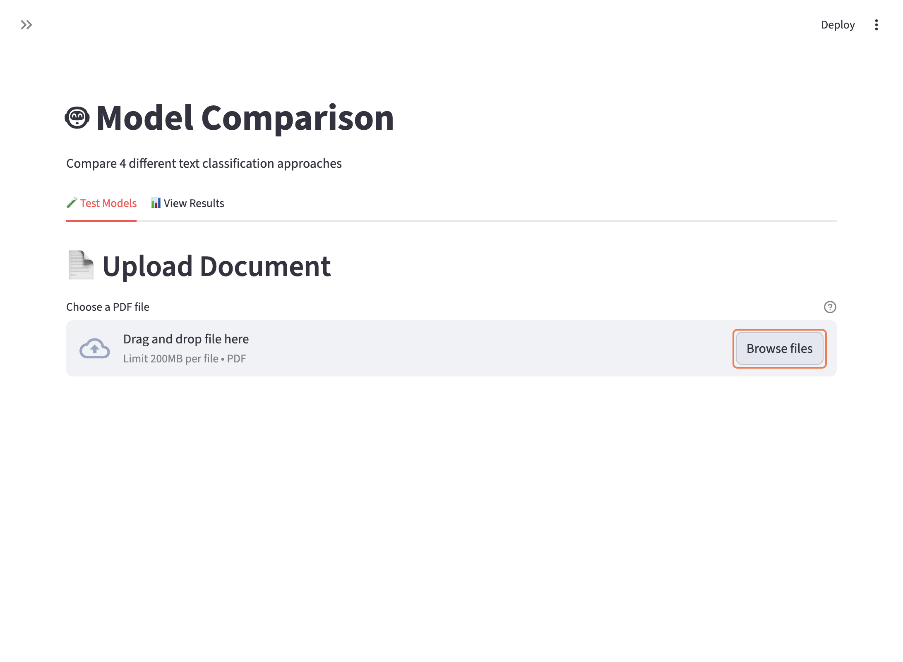
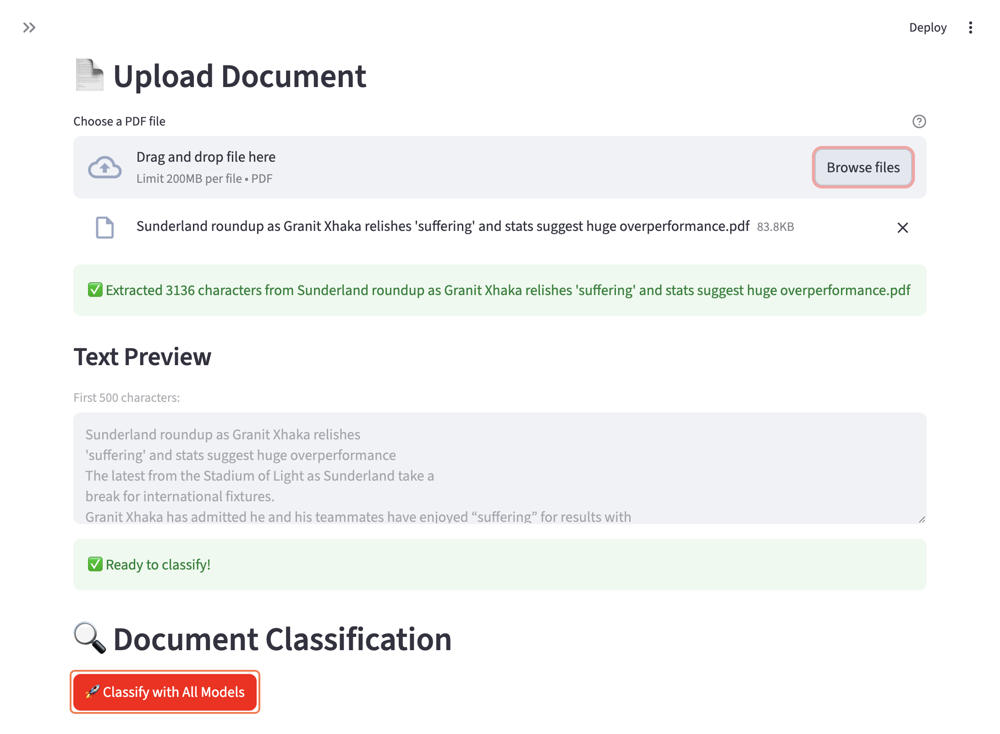
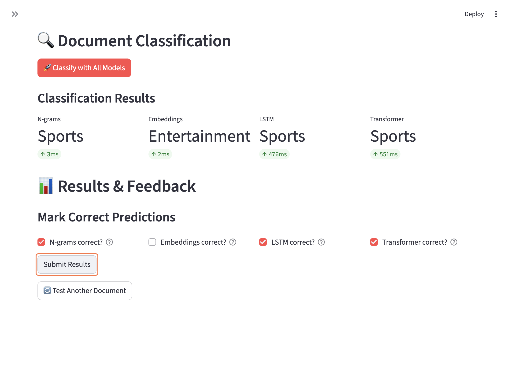
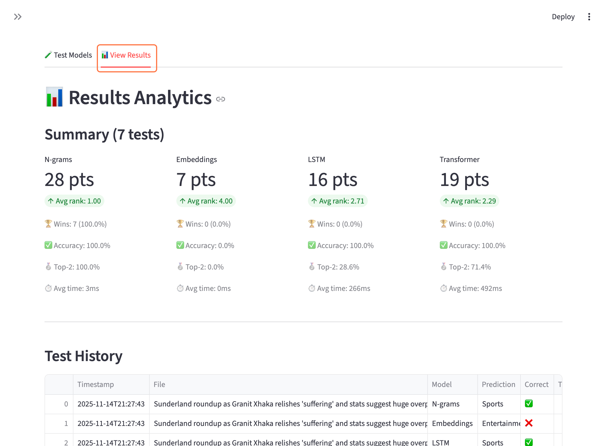

# Model Comparison App

After training four content classifier models to sort texts into the categories business, entertainment, health, politics, science,
sports and technology, it is now time to live test them with documents not part of the training set. To recap, the four contenders are:

1. N-grams (TF-IDF + logistic regression)
2. Embeddings
3. LSTM (recurrent neural network)
4. Transformer (DistilBERT)


**Notes**
- Models are loaded once at startup and cached for fast predictions
- Classification runs sequentially to show real-time progress
- Rankings prioritize correctness first, then speed as tiebreaker
- The app is not optimized for the transformer model's performance (runs on CPU instead of MPS/CUDA)

---
## Requirements & Start
The streamlit app was built with pandas, numpy, streamlit and pdfplumber on Python 3.10.11. If the _requirements.txt_
of this project or the _necessary individual packages_ were installed, there is no more to do except to start the app with the following terminal command:
```bash
cd demo
streamlit run app.py
```
After the command was executed successfully the demo application is now live on `http://localhost:8501`.

---
### Install Packages
Installing only the necessary packages:
```bash
pip install pandas>=2.2.0 numpy>=2.0.0 streamlit>=1.51.0 pdfplumber>=0.11.0
```
Installing all packages:
```bash
pip install -r requirements.txt
```
---

## Flow
After making sure that the requirements are set and the app has started correctly you can test the trained model by getting some
PDFs that contain content from **one** of the seven topics:
- business
- entertainment
- health
- politics
- science
- sports
- technology

After you prepared the PDF's you want to test follow this flow:

---

### 1: Upload a PDF document

Drag and drop or browse and select **one** PDF at the time into the Model Comparison app.
---

### 2. Review Upload & Start Classification

After the upload was successful, the text is extracted. In this example the PDF contains 3136 characters.
Once this is done, you can start the classification by pressing the button "**Classify with All Models**".
---

### 3. View & Rate Results

During the run, you can see the progress of the four models. After they are done, each of them output their
classification as well as the time needed to come to their conclusion. Since the PDFs are not within the training data
the models don't know if they are right or wrong. To grade their performance correctly, you need to select the checkboxes
of the respective models that got it right in this round. After this is done, you can click "**Submit Results**" to show
the rankings of this round and add them to the historical comparison JSONL file.

If you want to continue to test different PDFs you can start the flow all over again by pressing the "**🔁 Test Another Document**"
button.
___

### 4. Overall Classification Analysis

After testing all the PDFs you can switch to the "**📊 View Results**" tab at the top of the application. This then
shows the point total of the each model, as well as their average speed, accuracy rate, and number of wins. The ranking
of the models are determined by:
1. correctness
2. speed

Based on the ranking of each round, the models receive the points according to this logic:
- 4 points for 1st place
- 3 points for 2nd place
- 2 points for 3rd place
- 1 point for 4th place

Additionally, the detailed test history from the JSONL file is displayed bellow to scroll through. The file is saved
under `demo/results/classification_history.jsonl` but it is empty!

You have to do some tests yourself ;-)